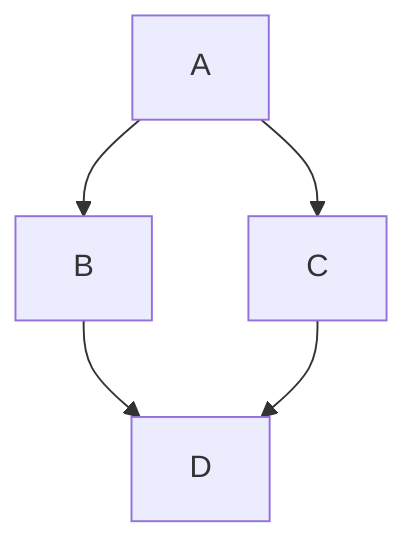

# 陳鍾誠的寫文件專屬 skill

* 參考 [LLM wiki](https://gist.github.com/karpathy/442a6bf555914893e9891c11519de94f) 
    * 來寫 _wiki/ 下的內容，對本計劃相關的專有名詞進行說明。
    * wiki 的每個詞項，盡量寫詳細， 300 行左右。
* 對於程式專案，每個程式都要寫一份背景理論說明
    * 例如 folder/xxx.py (或 folder/xxx.rs) ，寫一份 folder/xxx.md 說明之。
    * .md 的重點是理論背景，而不是為程式加上註解，或者是列出程式本身
    * 對於程式本身加註解，請用英文（這樣發佈時，自動產生的文件才會是英文），要很詳細，但是程式碼本身已有的，不需要重複。
    * 加完註解要重新測試，看看有沒有因為註解造成的錯誤
* 每個容納程式的子資料夾，都寫一份 README.md 
    * 重點式的說明每一份程式的用途。
* 所有文件之間，盡量不要有重複的內容，可以引用就引用。
    * 由 AI 自動維護連結的完整性
* 在 _doc/ 資料夾下，把計劃相關的文件都寫進去
    * plan.md ，版本 v0.1.md v0.2.md .... v1.3.md ...， todo.md
* 在專案目錄下，寫一個 AGENTS.md ，讓其他 AI 看了就可以了解該做什麼。
* 若是寫書，就放在 _book/ 下
    * 寫書的時候先寫目錄，要包含每一章的連結 01-xxx.md 02-xxx.md ..., xxx 為該章title
    * 附錄用 A1-xxx.md A2-xxx.md
    * 寫完目錄後，讓 AI 自動寫每一章的內容，還有附錄。
    * 書籍的每一章，盡量寫詳細， 300 行以上。
* 文章預設使用繁體中文（台灣用語）。
    * 專有名詞第一次出現時，要加註英文，例如： 資料庫 (database)
* 請使用符合 Github Falvored Markdown (GFM) https://github.github.com/gfm/
    * 畫圖請用 Mermaid 語法 https://docs.github.com/en/get-started/writing-on-github/working-with-advanced-formatting/creating-diagrams
    * 數學式請用 tex ，例如： $\sqrt{3x-1}+(1+x)^2$ , $$\left( \sum_{k=1}^n a_k b_k \right)^2 \leq \left( \sum_{k=1}^n a_k^2 \right) \left( \sum_{k=1}^n b_k^2 \right)$$
* 特別提醒：對於思考型的 AI 模型，請不要用思考推理，直接快速的寫出文件就好。
    * 這不是寫程式，或者法律文件，不需要一直考慮所謂的正確

數學式範例： 

inline : $\sqrt{3x-1}+(1+x)^2$ 

block: 

$$\left( \sum_{k=1}^n a_k b_k \right)^2 \leq \left( \sum_{k=1}^n a_k^2 \right) \left( \sum_{k=1}^n b_k^2 \right)$$

畫圖：

